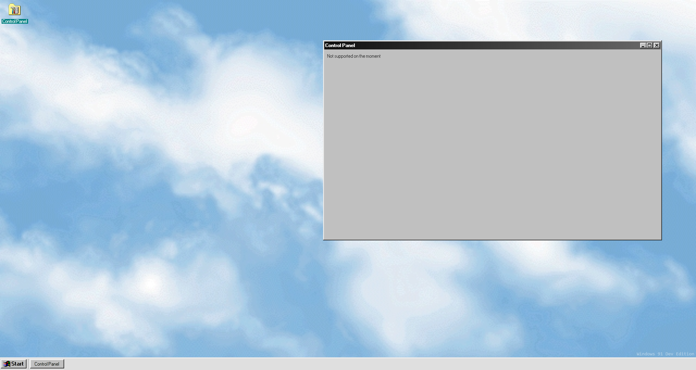

# [Windows 91](http://windows91.vercel.app)

[](https://github.com/Stilic/windows91/issues) [](https://github.com/Stilic/windows91/network) [](https://github.com/Stilic/windows91/stargazers) [](https://github.com/Stilic/windows91/blob/main/LICENSE) [](https://jquery.com)

A funny version of Windows 98.



## Setup

```bash
npm i # Install it
npm run build # Build it
npm run dev # Run developer server
npm run lint # Lint the code
```

## License

This repository is under the [MIT license](LICENSE).
